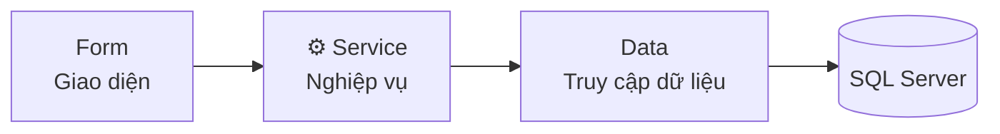

<div align="center">


### Phân tích thiết kế phần mềm hướng đối tượng

Từ yêu cầu nghiệp vụ đến mô hình UML, cơ sở dữ liệu và ứng dụng desktop.


**[ Các bài thực hành](#-các-bài-thực-hành) · [ Quản lý du lịch](#-lab5--quản-lý-công-ty-du-lịch) · [🚀 Cách chạy](#-cách-chạy)**

</div>

---

## Các bài thực hành

| Bài | Chủ đề | Tài liệu / mã nguồn |
| :---: | --- | :---: |
| **LAB1** | Mô hình UML và đặc tả Use Case | [Mở bài →](LAB1/) |
| **LAB2** | Hệ thống quản lý thư viện | [Mở bài →](LAB2/Quan_Ly_Thu_Vien/) |
| **LAB3** | Hệ thống quản lý khách sạn | [Mở bài →](LAB3/) |
| **LAB4** | Ứng dụng e-Shopping | [Mở bài →](LAB4/) |
| **LAB5** | Công ty du lịch Văn Hóa Việt | [Mở bài →](LAB5/) |

##  LAB5 · Quản lý công ty du lịch

Ứng dụng **C# WinForms · .NET Framework 4.7.2 · SQL Server**, tổ chức theo kiến trúc ba lớp.

| Nhóm chức năng | Nội dung |
| --- | --- |
|  Tour & hành trình | Tour, điểm dừng, phương tiện theo chặng, điểm tham quan |
|  Khách lẻ | Lịch chuyến, đăng ký và thanh toán vé |
|  Khách đoàn | Lập phiếu, đặt cọc, danh sách mua bảo hiểm |
|  Hướng dẫn viên | Phân công theo chuyến/đoàn, kiểm tra trùng lịch |
|  Kết thúc tour | Thanh toán kinh phí, khảo sát và góp ý |
|  Lương & thống kê | Lương HDV theo tháng và thống kê tổng hợp |

**[📄 Báo cáo Word](LAB5/BaoCao_QuanLyCongTyDuLich.docx)** · **[💻 Solution](LAB5/QuanLyCongTyDuLich/QuanLyCongTyDuLich.sln)** · **[🗄️ Script SQL](LAB5/QuanLyCongTyDuLich/Database/QuanLyCongTyDuLich.sql)** · **[📖 Hướng dẫn chi tiết](LAB5/QuanLyCongTyDuLich/README.md)**

## 🏗️ Kiến trúc ứng dụng



Form tiếp nhận thao tác; Service kiểm tra nghiệp vụ và điều phối giao dịch; Data thực thi truy vấn CSDL.

## 🚀 Cách chạy

1. Clone repository hoặc chọn **Code → Download ZIP**.
2. Cài **Visual Studio 2026**, workload **.NET desktop development** và SQL Server.
3. Chạy script SQL của bài, mở solution rồi cấu hình kết nối CSDL theo hướng dẫn trong từng project.
4. Restore NuGet, chọn Startup Project và nhấn **F5**.

> **Phiên bản .NET:** LAB2/LAB3 dùng .NET 10; LAB4/LAB5 dùng .NET Framework 4.7.2. Cài SDK hoặc Developer Pack tương ứng.

<details>
<summary><b> Cấu trúc repository</b></summary>

```text
LAB_AT_OOSD/
├── LAB1/    UML & đặc tả Use Case
├── LAB2/    Quản lý thư viện
├── LAB3/    Quản lý khách sạn
├── LAB4/    e-Shopping
├── LAB5/    Quản lý công ty du lịch
└── README.md
```

</details>

---

<div align="center">

**Yêu cầu → UML → Code → CSDL → Kiểm thử**

Bộ bài thực hành phân tích thiết kế và xây dựng ứng dụng.

</div>
